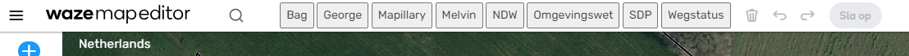

# WME-MapLinks

This script will add  buttons on top of WME allowing easy access to other sources like:

- BAG
- George
- Mapillary
- Melvin
- NDW
- Omgevingswet
- SDP
- Wegstatus

* Script will only work for when your language is set to Dutch.

## Code
Feel free to improve this script I will be happy to accept any pull-requests.

https://github.com/RobinBreman/WME-MapLinks
https://greasyfork.org/en/scripts/427793-wme-feed-sorter

## Changelog
|Version||
|---|---|
0.0.1 | Initial version

## About me
This script is developed by Robin Breman (@robbre), L4 editor Waze NL.