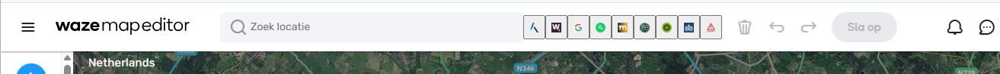

# WME-MapLinks

This script will add  buttons on top of WME allowing easy access to other sources like:

- BAG
- George
- Mapillary
- Melvin
- NDW
- Omgevingswet
- SDP
- Wegstatus

## Code
Feel free to improve this script I will be happy to accept any pull-requests.
https://github.com/RobinBreman/WME-MapLinks

## Changelog
|Version||
|---|---|
1.2.1 | [@J0kerNL] Updated bag link
1.2.0 | Added button images
1.1.0 | [@J0kerNL] Updated Wegstatus link, allowed script to run on all languages
1.0.0 | First Beta
0.0.1 | Initial version

## About me
This script is developed by Robin Breman (@robbre), L4 editor Waze NL.
